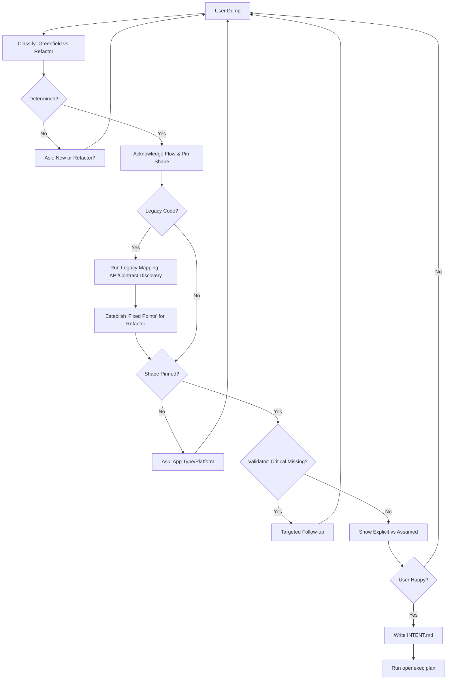

# Plan: Guided Intent Orchestration (The "Interviewer" Flow)

This document outlines the implementation plan for the **Guided Intent Interviewer** in OpenExec. The goal is to move from "writing a markdown file manually" to a structured, interactive dialogue that ensures high-leverage constraints (Platform, Shape, Contracts) are pinned before implementation starts.

---

## 1. Core Components

### A. The Schema (`intent_schema.json`)
A structured definition of a "ready-to-build" project. Using Pydantic (Python) for validation.
- **Project Identity:** Name, Problem Statement, Success Metric.
- **Delivery Shape:** CLI, Web, Mobile (iOS/Android), Desktop (Mac/Win/Linux), API, etc.
- **System Boundaries:** Inside vs. Outside, Third-party integrations.
- **Data Architecture:** Core entities (Nouns), State ownership, Persistence strategy.
- **Interface Contracts:** Protocol (REST/gRPC/GraphQL), Auth strategy.
- **Non-functionals:** SLOs (Latency, Size), Offline support, Deployment target.

### B. The Interviewer Agent (`openexec-orchestration`)
A specialized LLM agent wrapper that performs "Stateful Extraction":
1. **Input:** `(current_intent_json, last_user_message, conversation_history)`.
2. **Action:**
   - Extracts new facts into JSON.
   - Runs validation against the Pydantic schema.
   - Identifies "Assumptions" (inferred but not confirmed).
   - Generates the *next most impactful question* based on missing critical fields.
3. **Output:** `(updated_intent_json, next_question, explicit_vs_assumed_list, is_complete)`.

### C. The Interactive Loop (`openexec-cli`)
A terminal-based chat UI implemented in Go.
- **Command:** `openexec init --guided`
- **Session UI:** 
  - Standard input for user dump.
  - Sidebar or header showing "Project Completeness %".
  - Internal commands: `/status`, `/assumptions`, `/render`, `/done`.

## 2. The Classification Fork (Greenfield vs. Refactor)

Immediately after the **User Dump**, the system must perform a **Classification Pass** to determine the fundamental nature of the project.

### A. The Flow Selection
- **Greenfield Flow:** Building from scratch. Focus on scaffolding, architecture selection, and core feature sets.
- **Refactor Flow:** Modifying existing code. Focus on legacy mapping, API contracts, parity testing, and dependency discovery.

### B. User Acknowledgement
Once classified, the system **must** acknowledge the flow:
- *"I understand we are building a **new project** from scratch. I'll focus on architecture and scaffolding."*
- *"I understand we are **refactoring an existing project**. I'll focus on mapping your current APIs and ensuring parity."*

### C. Resolving Ambiguity
If the agent cannot determine the flow (e.g., "I want to improve my app"), it must ask:
- *"Are we building this from the ground up, or are we refactoring an existing codebase?"*

---

## 3. Refactoring & Legacy Migration Logic

When the user dump implies a refactor (e.g., "move X to Docker", "rewrite Y in Go"), the interviewer switches to **Legacy Discovery Mode**.

### A. Scope Discovery (The "What" Pin)
Force explicit bounds on the change:
- **Refactor Type:** Partial (Component-level) vs. Complete (System rewrite).
- **Domain:** Frontend only, Backend only, or Full-Stack.
- **Legacy Source:** Link to existing repo(s) or file paths.

### B. The Mapping Phase (Discovery-as-a-Task)
If documentation or architecture is missing, OpenExec creates **"Discovery Stories"** that must run *before* implementation:
1. **Contract Extraction:** Map existing API endpoints (Input, Output, Data types, Error codes).
2. **Entity Reconciliation:** Verify if legacy entities (DB tables) match the new plan.
3. **Black-box Testing:** Generate tests based on the extracted contract to ensure "No Regression."

### C. The "Full-Stack Local Parity" Rule
To prevent "Intent Gaps" (like the Guild-Hall Supabase missing from Docker):
- If the user says: "I want to run this locally."
- The interviewer asks: "What are ALL the dependencies (DBs, Auth, Storage, External APIs)?"
- **Rule:** Every dependency must have a corresponding "Infrastructure Intent" (e.g., "Add local Supabase container").

---

## 3. Implementation Phases

### Phase 1: Classification & Pinning (The "Failure Killer")
**Goal:** Prevent the "assume cross-platform" or "wrong stack" drift.
- **The "Platform Guard":** If `App Type` is "Desktop" and `Platform` is empty, the interviewer *must* block all architecture questions until Mac/Win/Linux is chosen.
- **The "Task vs Goal" Classifier:** If the user provides a task list ("Add a button"), the agent must first ask "What problem does this solve?" to find the underlying goal.

### Phase 2: System Boundary & Contracts
**Goal:** Ensure components actually communicate.
- **Entity Extraction:** Force the user to name the "5-10 core nouns" (e.g., User, Order, Flight).
- **Interface Pinning:** Ask "Where does the data live?" and "How does the Frontend talk to the Backend?".
- **Legacy Audit:** If refactoring, force a "Contract Mapping" story if APIs aren't documented.
- **Failure Mode Prompting:** "What happens if [External Service X] is down?"

### Phase 3: The `INTENT.md` Generator
**Goal:** Convert the verified JSON into the canonical OpenExec markdown format.
- Once `is_complete` is true, the agent renders `INTENT.md` with:
  - System Boundary diagram (Mermaid).
  - Explicit Platform/Stack constraints.
  - Verifiable SLOs (extracted from non-functionals).
  - **Prerequisite Discovery Stories** (if legacy mapping is needed).

---

## 5. Updated Workflow Logic



---

## 6. CLI UX Design

### Example: Refactoring Flow
```text
$ openexec init --guided

? Tell me about your project (Free-form dump):
> I want to move my guild-hall project to Docker so I can run it locally.

[Processing...]
I understand we are REFACTORING an existing project.
I'll focus on mapping your current APIs and ensuring local parity.

Shape: Web App / Docker
Explicit: Local Development
Missing: Legacy Repo Path, Platform (macOS/Win?), Supabase Local Setup?

? Which platform are you developing on? (macOS, Windows, Linux):
> macOS.

? Got it. Does your project have a local Supabase setup, or do you connect to a remote one?
> Remote only right now, but I want local.

[Constraint Added: Must containerize Supabase for local parity]
? Thanks. Please provide the path to your existing repository:
> ...
```

---

## 4. CLI UX Design

```text
$ openexec init --guided

? Tell me about your project (Free-form dump):
> I want to build a desktop tool for tracking flight prices on Helsinki airport.

[Checking...]
Shape: Desktop App
Missing: Platform (macOS/Windows/Linux?), Data Sources (API?), Success Metric.

? Which platforms should this support? (macOS, Windows, Linux):
> Just macOS for now.

[Explicit: macOS | Shape: Desktop]
? Got it. How will we fetch the flight data? Is there a specific API?
> ...
```

---

## 5. Next Steps for Implementation

1.  **Orchestration:** Create `src/openexec_orchestration/wizard.py` with the Pydantic schema.
2.  **Prompting:** Develop the `INTERVIEW_PROMPT` that strictly follows the "pin shape first" policy.
3.  **CLI:** Add `cmd/wizard.go` to `openexec-cli` using a TUI library (e.g., Bubbletea) for the chat experience.
4.  **Integration:** Connect the wizard output to the existing `openexec plan` story generation pipeline.
