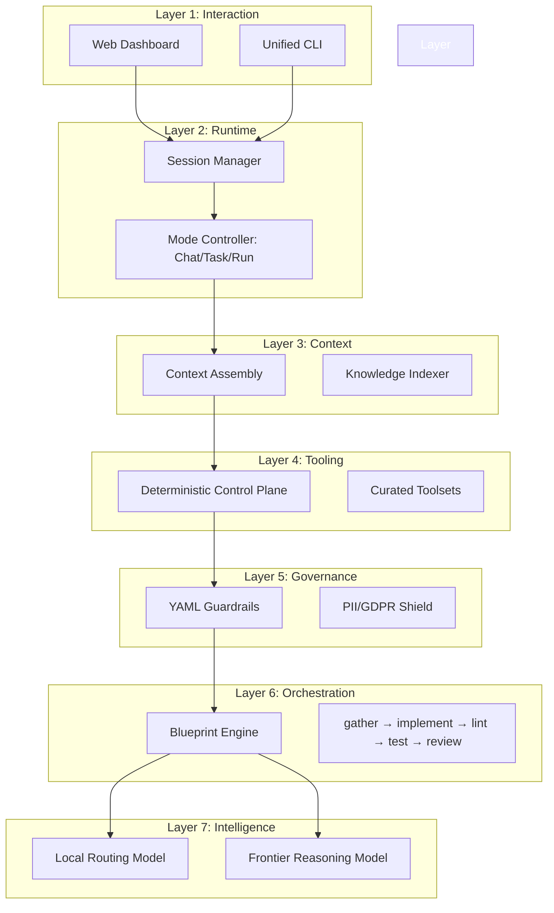
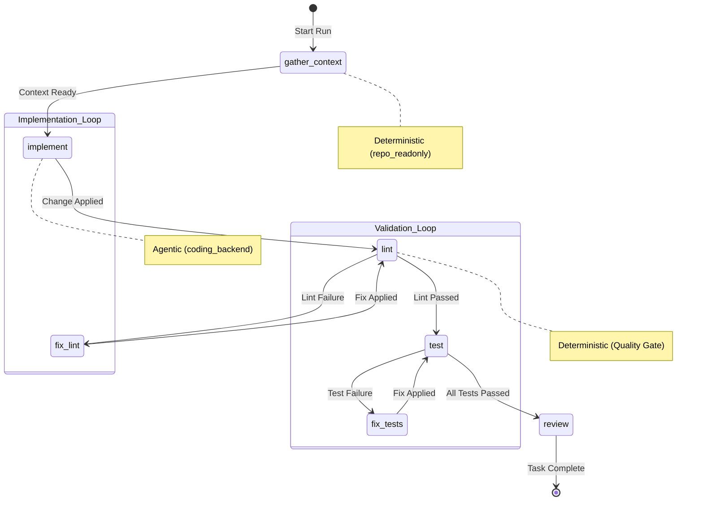

<p align="center">
  
</p>

<h1 align="center">OpenExec</h1>

<p align="center">
  <strong>The Deterministic AI Operating System: From Intent to Production</strong><br>
  <em>Treating AI systems as operational software, not just prototypes.</em>
</p>

<p align="center">
  
  
  
  
  
</p>

<p align="center">
  <a href="https://openexec.io">Website</a> •
  <a href="docs/GET_STARTED.md">Get Started</a> •
  <a href="#architecture">Architecture</a> •
  <a href="#blueprints">Blueprints</a> •
  <a href="https://github.com/openexec/openexec/issues">Report Bug</a>
</p>

---

## What is OpenExec?

**OpenExec** is a single-binary task orchestration framework designed to treat AI agents as managed workers in a structured, production-grade pipeline. Built by a platform engineer with 20+ years of high-scale experience, it bridges the machine speed of AI with the institutional trust required for real-world business flows.

Unlike experimental "chat-and-hope" AI tools, OpenExec treats AI orchestration as **operational software**: observable, deterministic where required, and fully auditable. It plans, reviews, executes, and validates every change through a recursive autonomous loop.

## ⚡ Core Capabilities

| 🛡️ **Safety Gates** | 🧠 **Local Context** | 🔐 **PII Shield** |
| :--- | :--- | :--- |
| YAML-based guardrails block unsafe code before it hits your disk. | Local indexing ensures LLMs only see what they need—reducing cost and risk. | Automatic local scrubbing of emails, IP addresses, and sensitive metadata. |

## Core Pillars: Turning Intent into Reliable Execution

OpenExec embeds governance and observability directly into the orchestration architecture.

1.  **Operational AI:** AI systems are treated as software dependencies with strict SLAs, not black-box experiments.
2.  **Safety by Design (Rule-Based Logic):** Translate organizational policies into local YAML guardrails. Rules act as physical gates—if an action breaks policy, the system blocks it locally before it happens.
3.  **Production-Grade Observability:** Built-in instrumentation for every decision and tool call. Records not just *what* changed, but *why*, providing a complete reasoning chain for accountability.
4.  **Institutional Memory (Owned Logic):** You own the library of logic the AI builds. Organizational patterns stay local, enabling you to swap AI providers without losing operational intelligence.
5.  **Information Limiting (Privacy-First):** Precise context assembly ensures cloud models only receive the specific context required for the task. Sensitive metadata stays behind your firewall.
6.  **Digital Flight Recorder:** Every autonomous loop is recorded in a tamper-proof SQLite vault, ensuring full auditability for compliance and debugging.

---

## Architecture

OpenExec is a **Self-Contained Monolith** designed for high-integrity autonomous operations. It follows a converged architecture pattern: **deterministic local runtime** providing safety and grounding, with **frontier models** providing high-level reasoning.

### The 7-Layer Operational Model



### Blueprint Execution Flow

Every task is executed through a hardened, stage-based pipeline that ensures verification happens at every step.



### Operational Primitives

| Component | Implementation | Role |
| :--- | :--- | :--- |
| **DCP** | `internal/dcp` | Deterministic routing and tool execution control. |
| **Toolsets** | `internal/toolset` | Role-based grouping of capabilities (e.g., `coding_backend`, `debug_ci`). |
| **Blueprints** | `internal/blueprint` | Stage-based graph execution with built-in retries and checkpoints. |
| **Persistence** | `pkg/db/state` | Canonical state store using SQLite for immutable task traces. |

---

## Quick Start

For a detailed walkthrough, see the **[Getting Started Guide](docs/GET_STARTED.md)**.

### 1. Installation
Download the latest binary for your platform, or use the automated script:

```bash
# Default (installs to /usr/local/bin or ~/.local/bin)
curl -sSfL https://openexec.io/install.sh | sh
```

### 2. The Execution Flow
Follow these steps to transform an idea into a verified project:

1.  **Initialize (`git init && openexec init`)**: Set up the project and select your preferred AI models.
2.  **Guided Interview (`openexec wizard`)**: Chat with the AI Architect to generate a verified `INTENT.md`.
3.  **Plan (`openexec plan INTENT.md`)**: Decompose intent into a structured set of technical stories and tasks.
4.  **Start Server (`openexec start --ui`)**: Launch the visual dashboard and background daemon.
5.  **Run (`openexec run`)**: Execute tasks through the specialized **Autonomous Pipeline**.

---

## Contributing

We welcome engineers and AI enthusiasts to help evolve the orchestration plane.
Please see [CONTRIBUTING.md](CONTRIBUTING.md) for guidelines.

---

<p align="center">
  Built with AI, for production-grade AI orchestration.
</p>
