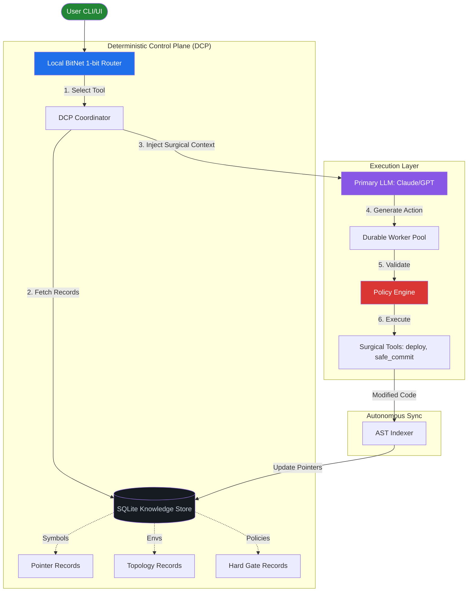

<p align="center">
  
</p>

<h1 align="center">OpenExec</h1>

<p align="center">
  <strong>The Deterministic AI Operating System: From Intent to Production</strong>
</p>

<p align="center">
  <a href="#what-is-openexec">Overview</a> •
  <a href="#conversational-orchestration">Conversational Mode</a> •
  <a href="#how-to-start">Quick Start</a> •
  <a href="docs/GET_STARTED.md">Getting Started Guide</a> •
  <a href="#architecture">Architecture</a> •
  <a href="#contributing">Contributing</a>
</p>

<p align="center">
  
  
  
</p>

---

## What is OpenExec?

**OpenExec** is a single-binary task orchestration framework designed to close the gap between human high-level intent and verified, production-ready code.

Unlike "chat-and-hope" AI tools, OpenExec treats AI agents as managed workers in a structured pipeline. It doesn't just write code; it **plans, reviews, executes, and validates** every change through a recursive autonomous loop.

## Core Pillars: Turning Policy into Reality

OpenExec closes the gap between human high-level intent and verified production code by embedding governance directly into the architecture.

1.  **Governance by Design (Deterministic Boundaries):** Evaluates boundaries at runtime. Before an agent acts, it must pass through "Hard Policy Gates." Stability is built into the loop.
2.  **Owned Intelligence vs. Vendor Lock-in:** The Local Knowledge Map (DCP) ensures project intelligence lives on your machine in an open format. You own the map; models are just interchangeable workers.
3.  **Sovereignty through Hybrid Brains:** v0.1.6 enables Hybrid Model Selection (Cloud + Local). Local Tool Search (RAG for Tools) reduces API data leakage by 47% by filtering information locally.
4.  **The Immutable Audit Trail:** Records every AI decision and state change in a local, encrypted vault. Verified evidence for SOC2, ISO 27001, or public sector accountability.

**Governance doesn't slow us down. Done right, it's the only way to move at machine speed safely.**

---

## Deterministic Control Plane (DCP)

OpenExec introduces a **Deterministic Control Plane** that transforms AI agents from "generative guessers" into "surgical operators." By moving project knowledge into structured relational tables, we eliminate hallucinations and drastically reduce latency.

### Core Pillars
- **Surgical Memory:** Specialized SQLite tables for code symbols, environment topologies, and API contracts.
- **Local Intent Routing:** 1-bit LLM wrapper for high-speed local tool selection.
- **Hard Policy Enforcement:** A local validation layer that blocks dangerous actions before they ever reach your project.

### Knowledge CLI
Manage your project's deterministic brain directly from the terminal:
```bash
# Index your source code (populates surgical pointers)
openexec knowledge index .

# List all DCP-enabled projects on your system
openexec knowledge ls

# Inspect recorded symbols or environment topologies
openexec knowledge show symbols
openexec knowledge show envs
```

**Full Documentation:** [docs/KNOWLEDGE_BASE.md](docs/KNOWLEDGE_BASE.md)

---

## Quick Start

For a detailed walkthrough, see the **[Getting Started Guide](docs/GET_STARTED.md)**.

### 1. Installation
Download the latest binary for your platform (macOS, Linux, Windows), or build from source:

```bash
# One-line install (macOS/Linux)
curl -sSfL https://openexec.io/install.sh | sh

# Build from source (all platforms)
go build -o openexec ./cmd/openexec
```

### 2. The Execution Flow
Follow these steps to transform an idea into a verified project:

1.  **Initialize (`git init && openexec init`)**
    Set up Git if necessary, then run the OpenExec initialization to select your preferred AI models.
2.  **Guided Interview (`openexec wizard`)**
    Chat with the AI Architect to define your project shape, platform, and contracts. It generates a verified `INTENT.md`.
3.  **Plan (`openexec plan INTENT.md`)**
    OpenExec decomposes your intent into a structured set of technical stories and tasks by chatting with the AI agent.
4.  **Start Server (`openexec start --ui`)**
    Launch the integrated server and open the web dashboard in your browser.
5.  **Run (`openexec run`)**
    The agents begin implementing your tasks, protected by the **Autonomous Compliance Shield**.

---

## Architecture

OpenExec is a **Self-Contained Monolith** designed for atomic deployment and maximum reliability.



| Component | Role | Implementation |
| :--- | :--- | :--- |
| **CLI** | Unified Interface | Go (Cobra) |
| **Planner** | Story & Goal Generation | Chat with AI Agent |
| **Wizard** | Requirement Gathering | Chat with AI Agent |
| **Orchestrator** | Durable Task Execution | Go + SQLite |
| **DCP** | Deterministic Knowledge | SQLite + BitNet (Local) |
| **Dashboard** | Visual Hub | React (Embedded in binary) |

---

## Local UI Development

The CLI and orchestration engine are delivered as a single binary with the UI embedded. For development of the React dashboard:

```bash
cd ui
npm install
npm run dev -- --port 3001
```

Open the dashboard at http://localhost:3001. The dev server proxies requests to the backend started via `openexec start`.


---

## Contributing

We welcome engineers, architects, and AI enthusiasts to help evolve the orchestration plane.
Please see [CONTRIBUTING.md](CONTRIBUTING.md) for guidelines.

---

<p align="center">
  Built with AI, for AI-assisted development.
</p>
