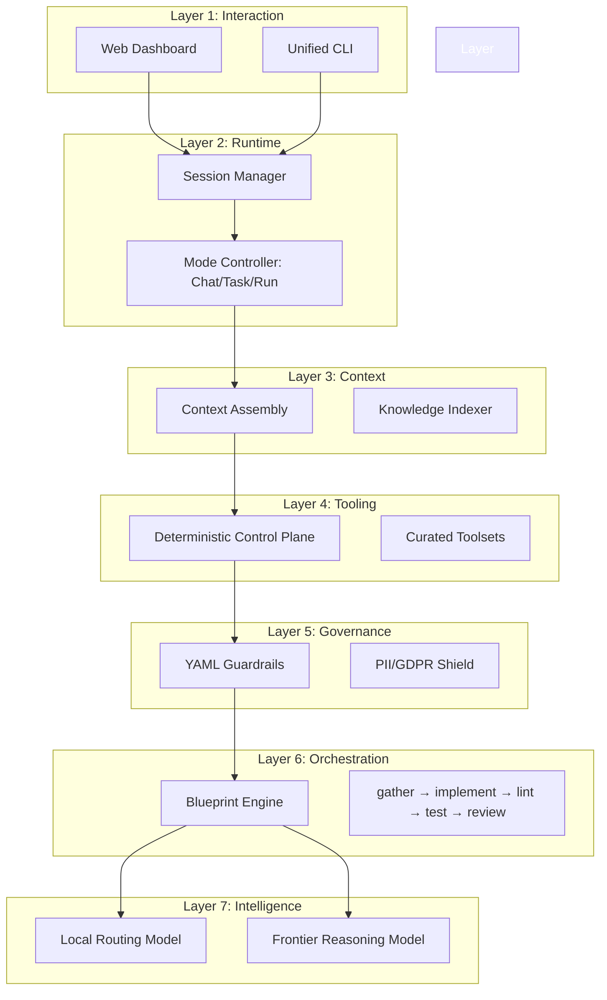
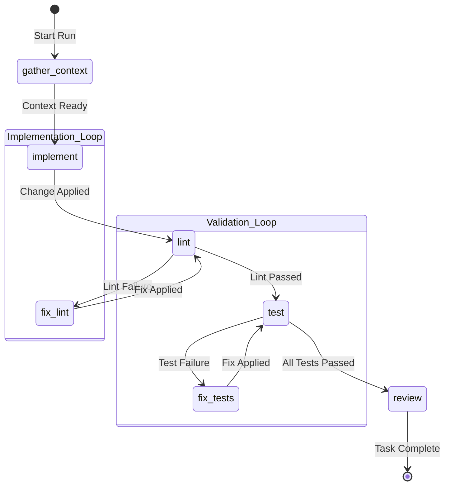

<p align="center">
  
</p>

<h1 align="center">OpenExec</h1>

<p align="center">
  <strong>The Deterministic AI Operating System: From Intent to Production</strong><br>
  <em>The professional's alternative to "chat-and-hope" AI development.</em>
</p>

<p align="center">
  
  
  
  
  
</p>

---

## 💡 Why OpenExec?

Most AI coding tools (like Claude Code or GitHub Copilot) operate as **black boxes**: you send your code to the cloud, hope for the best, and manually verify the results. 

**OpenExec is different.** It is designed by platform engineers for developers who need **predictability, privacy, and production standards** in their AI workflows.

### The OpenExec Difference

| Feature | Typical AI Agents | OpenExec |
| :--- | :--- | :--- |
| **Privacy** | Sends raw source & metadata to cloud. | **PII Shield:** Scrubs emails, keys, and IPs locally. |
| **Context** | Generic "search" or file-at-a-time. | **Knowledge Base:** Maintains a dynamic map of your whole repo. |
| **Reliability** | "Try and see" - code might break your app. | **Safety Gates:** YAML rules block unsafe code *before* it runs. |
| **Workflow** | Linear chat interface. | **Blueprint Engine:** Structured pipelines (Plan → Code → Lint → Test). |
| **Ownership** | Logic lives in the cloud provider. | **Institutional Memory:** Your patterns stay in your local library. |

---

## ⚡ Core Benefits for Developers

### 🛡️ Prevent Data Leakage
Stop accidentally sending your `.env` files, production database IPs, or sensitive customer emails to LLM providers. OpenExec's **local PII shield** automatically masks sensitive data before it ever leaves your machine.

### 🧠 Always-Current Knowledge Base
OpenExec doesn't just read files; it understands your project. It maintains a **local knowledge map** that indexes your functions, classes, and logic, ensuring the AI always has the precise context it needs to be accurate.

### 🚦 Move Fast, Safely
Treat AI as a managed worker. With **Safety Gates**, you define the rules (e.g., "never modify auth logic without a test"). If the AI tries to break a rule, the system blocks the action locally and suggests a fix.

---

## 🚀 Quick Start

### 1. Installation
Download the latest binary for your platform, or use the automated script:

```bash
# Default (installs to /usr/local/bin or ~/.local/bin)
curl -sSfL https://openexec.io/install.sh | sh
```

### 2. Transform Intent into Code
1.  **`openexec init`**: Set up your project and AI models.
2.  **`openexec wizard`**: Define your goal. It generates a verified `INTENT.md`.
3.  **`openexec run`**: Watch as OpenExec executes the **Autonomous Pipeline** to build, test, and verify your changes.

---

## 🛠️ Technical Deep Dive

OpenExec is a **Self-Contained Monolith** that follows a converged architecture: **deterministic local runtime** providing safety, with **frontier models** providing reasoning.

### The 7-Layer Operational Model



### Blueprint Execution Flow



---

## Contributing

We welcome engineers and AI enthusiasts to help evolve the orchestration plane.
Please see [CONTRIBUTING.md](CONTRIBUTING.md) for guidelines.

---

<p align="center">
  Built with AI, for production-grade AI orchestration.
</p>
