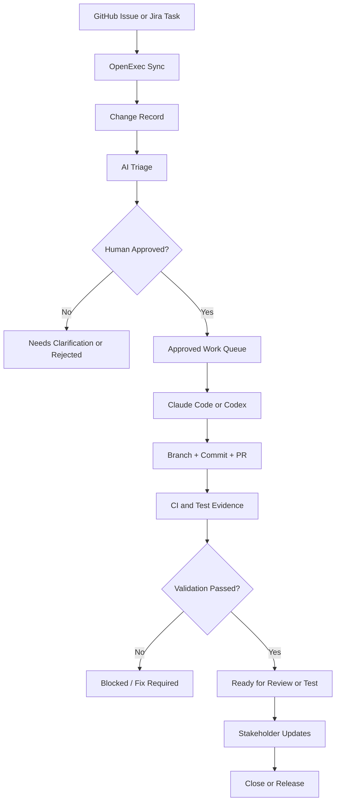
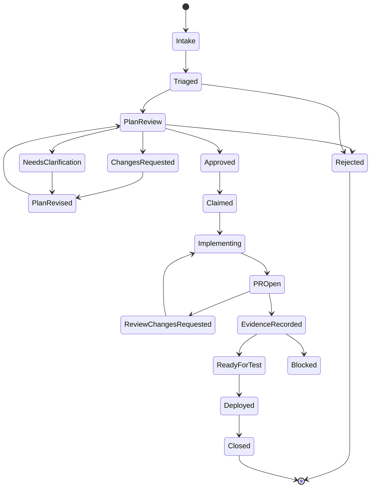
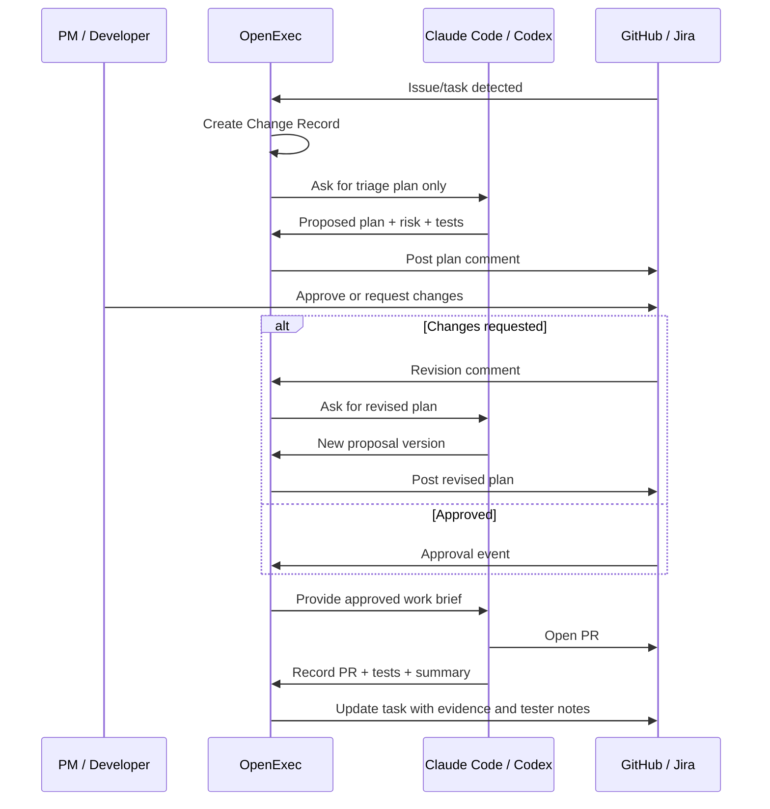
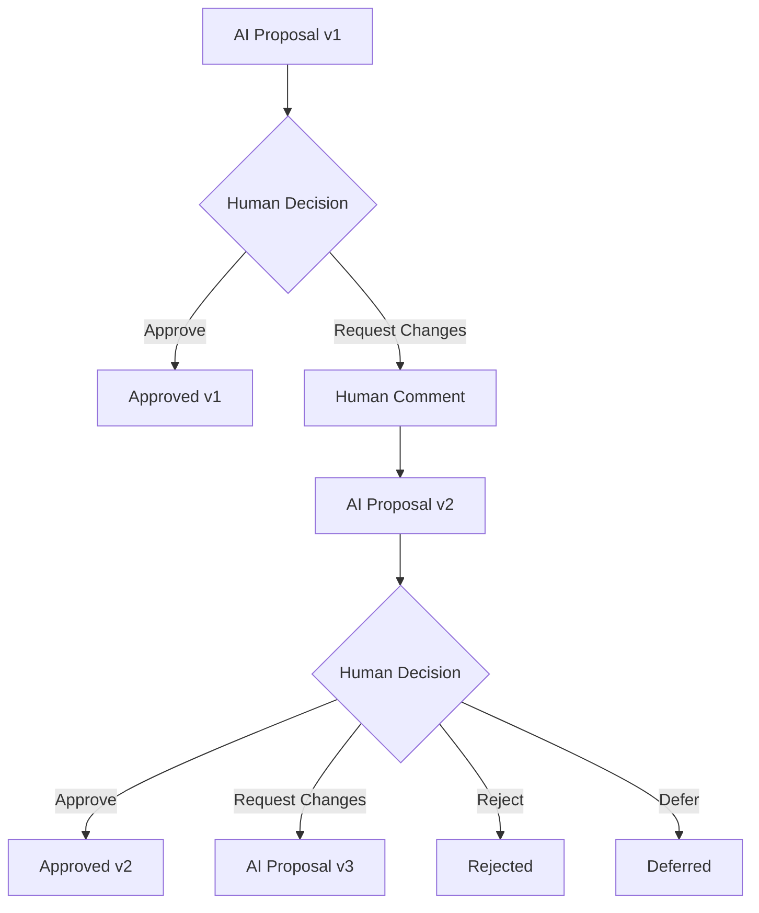
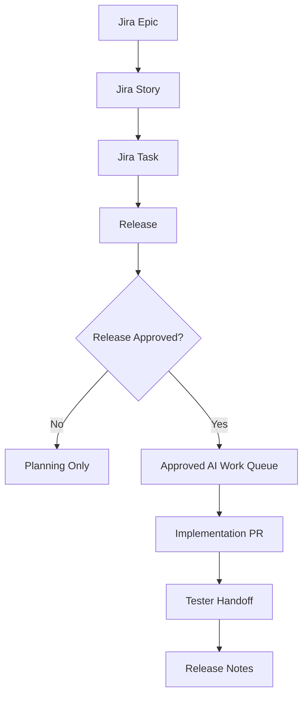
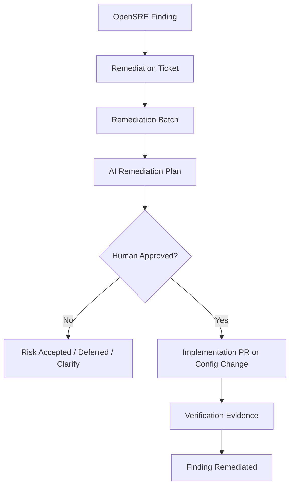

# Git-Linked Governance Flow

## Purpose

This document shows how OpenExec can link to a Git repository, turn GitHub issues or Jira tasks into governed AI work, validate each transition, and return evidence to the source system.

The goal is not to replace Claude Code, Codex, GitHub, or Jira. The goal is to make AI implementation repeatable, transparent, and approval-driven.

```text
GitHub/Jira remains the work surface.
Claude Code/Codex remains the implementation engine.
OpenExec is the governance layer between them.
```

## High-Level Flow



## Repository Linking

OpenExec links a local project to its Git source and external work tracker.

```bash
openexec project link \
  --repo agenticsnz/unsorry \
  --path /Users/perttu/projects/unsorry \
  --tracker github
```

For Jira-backed projects:

```bash
openexec project link \
  --repo Agileday/agileday-core \
  --path /Users/perttu/projects/agileday-core \
  --tracker jira \
  --jira-project AD
```

The link creates a local project record:

```yaml
project_id: unsorry
repo: agenticsnz/unsorry
path: /Users/perttu/projects/unsorry
tracker: github
default_branch: main
approval_policy: approval
```

## Change Record Lifecycle



## Validation Gates

OpenExec validates every transition. The AI can propose transitions, but OpenExec decides whether they are allowed.

| Transition | Required Evidence |
|---|---|
| `Intake -> Triaged` | classification, summary, source link |
| `Triaged -> Plan Review` | proposal version, plan, risk, verification plan |
| `Plan Review -> Changes Requested` | human comment and requested changes |
| `Changes Requested -> Plan Revised` | new proposal version |
| `Plan Review -> Approved` | human approval or release approval for the current proposal version |
| `Approved -> Claimed` | no active claim, project write lock available |
| `Claimed -> Implementing` | implementation plan exists |
| `Implementing -> PR Open` | branch, PR URL, linked change ID |
| `PR Open -> Review Changes Requested` | human review comment |
| `PR Open -> Evidence Recorded` | CI/test result, changed files, implementation summary |
| `Evidence Recorded -> Ready for Test` | tester handoff generated |
| `Ready for Test -> Deployed` | deployment event or manual release note |
| `Deployed -> Closed` | source issue updated, communication generated |

## Approval Boundary



Important rule:

```text
AI may chat, triage, and draft plans freely.
AI may implement only approved work.
AI may request "done" only through OpenExec validation.
Approval applies to one proposal version only.
```

## Human Iteration Loop

Review is not a one-time yes/no gate. The PM, developer, tester, reviewer AI, bugbot, security bot, or verifier may ask the AI to revise a plan or implementation until it is approved, rejected, deferred, or cancelled.



Supported human commands:

```text
/openexec approve
/openexec revise <comment>
/openexec reject <reason>
/openexec defer <reason>
/openexec request-tests <comment>
```

Versioning rule:

```text
Every AI proposal has a version.
Approval is valid only for the exact approved version.
If the proposal changes, approval is invalidated until a human approves the new version.
```

This prevents a task from being approved for one scope and implemented with another.

## Review Authorities

The approver does not always need to be a human. OpenExec should model each reviewer as a review authority with explicit permissions.

```text
Planner AI       -> drafts the plan
Reviewer AI      -> critiques the plan
Bugbot           -> checks likely bugs, missing tests, and edge cases
Security bot     -> flags auth, secret, infra, and permission risk
Tester AI        -> checks whether acceptance criteria are testable
Human            -> approves or rejects where policy requires
Verifier         -> approves only deterministic evidence
Implementor AI   -> writes code after approval
```

Example authority policy:

```yaml
review_authority:
  type: ai
  name: bugbot
  permissions:
    - comment
    - request_changes
    - recommend_approval
  cannot:
    - approve_high_risk
    - mark_done
    - risk_accept
```

The important rule:

```text
The same actor should not plan, approve, implement, and mark done for non-trivial work.
```

Example policy tiers:

```yaml
docs_low_risk:
  plan_reviewers: [bugbot]
  approval: ai_allowed
  implementation: any_agent
  done_requires: [test_evidence]

product_feature:
  plan_reviewers: [bugbot, tester_ai]
  approval: human_required
  implementation: any_agent
  done_requires: [pr_merged, tester_handoff]

security_change:
  plan_reviewers: [bugbot, security_ai]
  approval: human_required
  implementation: restricted_agent
  done_requires: [ci_passed, security_review, human_signoff]
```

This allows AI review to replace or assist human review for low-risk work, while preserving human approval for product, security, infra, and risk-acceptance decisions.

## Validation Examples

### Valid Implementation

```text
Issue has label: ai:approved
Change Record has approved proposal version
Project has no active write lock
AI opens PR with Change Record ID
CI passes
OpenExec records tester notes
Task moves to ready_for_test
```

### Rejected Implementation

```text
Issue has no approval label
AI tries to claim task
OpenExec refuses claim
Task remains triaged
OpenExec comments: "Implementation requires approval"
```

### Rejected Stale Approval

```text
Proposal v2 was approved
AI creates proposal v3 after new human feedback
AI tries to claim task
OpenExec refuses claim
Task returns to Plan Review
OpenExec comments: "Approval is stale; proposal v3 needs approval"
```

### Blocked Completion

```text
PR exists
No test evidence was recorded
AI requests done
OpenExec refuses transition
Task remains PR Open or Blocked
```

## Release-Governed Variant

For company workflows, work should be assigned to a release before implementation.



Release rule:

```text
AI may implement only tasks assigned to an approved release,
except for explicitly approved hotfix releases.
```

## SRE Remediation Variant



SRE rule:

```text
AI may not close a finding without verification evidence.
AI may not mark risk accepted without human sign-off.
```

## Minimal Demo

The first demo should prove this flow:

```text
GitHub issue with ai:triage
-> OpenExec creates Change Record
-> AI writes implementation plan
-> human adds ai:approved
-> Claude Code/Codex implements
-> PR opens
-> OpenExec records evidence
-> issue receives tester notes and PM summary
```

Success means the developer never copies issue text into a terminal, and the PM/tester can see what happened from GitHub/Jira.

## Known Gaps To Close

Before using this for real autonomous implementation, OpenExec must explicitly handle:

- identity and permissions: AI must not approve its own work;
- idempotency: repeated syncs and retries must not duplicate records or comments;
- source-of-truth conflicts: define how local state, GitHub labels, and Jira statuses reconcile;
- stale claims: abandoned work must expire or be manually released;
- dirty worktrees: refuse or approve edits when local user changes exist;
- branch and PR policy: every PR must link to the Change Record and avoid unrelated scope;
- security boundaries: workflow, token, branch-protection, verifier, and infra changes are high risk;
- evidence quality: tester and PM summaries must cite actual PR/test/deploy evidence;
- notification noise: prefer sticky comments or status updates over repeated comment spam;
- Jira/release enforcement: GitHub-first is enough for the demo, but release-gated Jira work is required for company use.
