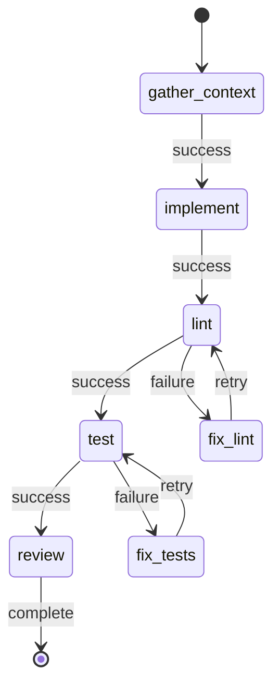

# OpenExec Execution State Machine

This document describes the deterministic state machine that governs execution in OpenExec. OpenExec uses a **Blueprint Engine** as its orchestration model.

## 1. The Blueprint Engine

The Blueprint Engine executes a graph of **Stages**. Each stage is either **Deterministic** (runs local commands) or **Agentic** (requires AI reasoning).

### Standard Task Blueprint
The standard flow for implementing a task follows this sequence:

```
gather_context -> implement -> lint (-> fix_lint) -> test (-> fix_tests) -> review
```

| Stage | Type | Description |
|-------|------|-------------|
| `gather_context` | Deterministic | Assembles files, symbols, and project metadata. |
| `implement` | Agentic | Frontier model generates code changes/patches. |
| `lint` | Deterministic | Executes project-specific linters (e.g., `go vet`, `ruff`). |
| `fix_lint` | Agentic | Triggered on lint failure; AI attempts to fix errors. |
| `test` | Deterministic | Executes project test suite (e.g., `go test`, `pytest`). |
| `fix_tests` | Agentic | Triggered on test failure; AI attempts to fix regressions. |
| `review` | Agentic | Final quality check and implementation summary. |

### Blueprint Features
- **Conditional Routing:** Stages can route to different next stages based on success or failure.
- **Automatic Retries:** Agentic stages support bounded retries for self-correction.
- **Checkpoints:** State is persisted at key stages to allow resuming after a pause or crash.

---

## 2. Run Statuses

Every **Run** progresses through these top-level statuses:

| Status | Description |
|--------|-------------|
| `pending` | Created but not yet started. |
| `running` | Actively executing stages. |
| `paused` | Temporarily suspended (waiting for human approval or retry backoff). |
| `complete` | Successfully finished all requirements. |
| `failed` | Encountered an unrecoverable error or exhausted retries. |
| `stopped` | Manually terminated by the operator. |

---

## 3. Observability and Events

The state machine emits versioned events to the **Audit Vault** (`.openexec/openexec.db`):

| Event | Description |
|-------|-------------|
| `stage_start` | Execution unit initiated. |
| `iteration_start` | Individual loop iteration begins. |
| `tool_use` | Agent invoked a specific tool (e.g., `write_file`). |
| `route_decision` | Transition choice made by the engine or agent. |
| `operator_attention` | Human intervention required (e.g., max retries reached). |
| `checkpoint_created` | State persisted for resume capability. |

---

## 4. Determinism and Replay

OpenExec ensures reliability through:
1. **Idempotency Keys:** Prevent duplicate tool executions during a resume.
2. **Artifact Hashing:** All patches and logs are content-addressed.
3. **Event Sourcing:** The full execution history is stored, allowing `openexec replay <run-id>`.

---

## 5. Stage Transitions



---

*Key Implementation: `internal/blueprint/`, `internal/loop/`*

> **Note**: For documentation on the legacy 5-phase pipeline (TD/IM/RV/RF/FL), see [docs/archive/LEGACY_5PHASE_PIPELINE.md](./archive/LEGACY_5PHASE_PIPELINE.md).
