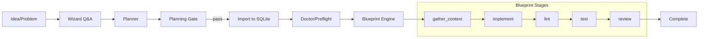

# Visualization Guide

This guide gives you a ready-to-draw blueprint for diagrams. Use these shapes and edges to explain OpenExec's flow.

## Swimlanes
- Roles: User, Wizard, Planner, Orchestrator (Server/Manager), Blueprint Engine, AI Model
- Artifacts: INTENT.md, SQLite DB (`.openexec/openexec.db`), Artifacts (`.openexec/artifacts/`)
- Controls: Doctor/Preflight, Planning Gate, Health API

## Node Sequence
1) Idea (User)
2) Wizard (Q&A) -> INTENT.md (PRD)
3) Planner -> SQLite (stories, tasks, dependencies)
4) Planning Gate (schema + goal coverage) -> pass/fail with hints
5) Story Import and Reconciliation
   - Create/Update stories and tasks in SQLite
   - Enforce story barriers and intra-story sequence
6) Doctor/Preflight
   - Resolve runner (model configuration)
   - PATH preflight, auth hints
   - /api/health exposes runner {command,args,model}
7) Blueprint Execution (gather_context -> implement -> lint -> test -> review)
   - Runner receives prompts (claude/codex/gemini)
   - Gates via openexec.yaml and verification scripts
8) Recovery
   - Checkpoint resume from any stage
   - Auto-heal for already-implemented code

## Edges (Data)
- Wizard -> INTENT.md
- Planner -> SQLite DB (stories and tasks)
- Blueprint Engine -> .openexec/artifacts/ during execution
- Health -> GET /api/health returns runner metadata

## Mermaid (starter)

## Legend
- Blue: Roles, Orange: Controls, Green: Artifacts, Purple: Blueprint stages
- Thick arrows: control flow; thin arrows: data artifacts

## Blueprint Stage Details

| Stage | Type | Toolset | Description |
|-------|------|---------|-------------|
| `gather_context` | Deterministic | repo_readonly | Gather relevant files and project metadata |
| `implement` | Agentic | coding_backend | Frontier model makes code changes |
| `lint` | Deterministic | coding_backend | Run configured linters |
| `fix_lint` | Agentic | coding_backend | AI fixes linting errors if they occur |
| `test` | Deterministic | coding_backend | Run project test suite |
| `fix_tests` | Agentic | coding_backend | AI fixes failing tests |
| `review` | Agentic | repo_readonly | Final verification and summary |

## Tips
- Show toolset boundaries: each stage uses a specific toolset with permission scoping
- Annotate runner mapping (model configuration) next to Preflight; add /api/health box
- Show SQLite as the central state store connecting all components

---

> **Note**: For legacy visualization documentation (5-phase pipeline, JSON storage), see [docs/archive/](./archive/).
