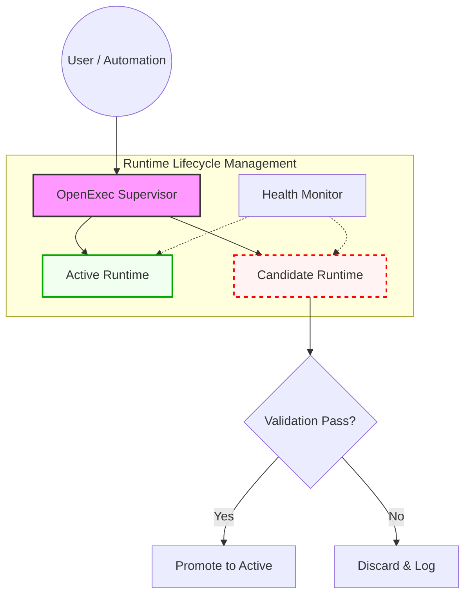

# OpenExec Self-Healing & Self-Upgrade Architecture

**Version:** v0.1  
**Status:** Future Capability (Post-v1)

The OpenExec Self-Healing Architecture enables the runtime to diagnose, repair, and upgrade itself safely without risking system stability. Instead of modifying itself directly, OpenExec evolves through isolated candidate runtime generation and supervised promotion.

## 1. High-Level Architecture
The architecture introduces a **Supervisor Layer** above the runtime to manage life-cycles and safe transitions.



## 2. Core Principle: Replace, Don't Mutate
The active runtime never modifies its own live process. This "immutable runtime" pattern ensures that OpenExec follows the same disciplined deployment workflows used in high-availability systems (blue/green deployments).

1.  **Diagnose:** Runtime detects an issue (e.g., repeated crash, policy failure) or receives an upgrade signal.
2.  **Build:** A candidate runtime is built in an isolated environment (worktree or container).
3.  **Test:** The candidate must pass unit tests, integration tests, and **Golden Run Replays**.
4.  **Promote:** The Supervisor stops the active process and activates the candidate.
5.  **Rollback:** If health checks fail in the observation window, the Supervisor reverts to the previous version.

## 3. Self-Healing Triggers
*   **Runtime Failures:** Panics, deadlocks, or repeated stage failures.
*   **Behavioral Degradation:** Growing latency, resource leaks, or excessive retries.
*   **Policy Violations:** Unexpected tool invocations or data scrubbing failures.
*   **Observability Signals:** Telemetry anomalies or replay mismatches.

## 4. Candidate Validation & Replay
Before promotion, a candidate must reproduce **Golden Runs**—historical runs representing known-good behavior (e.g., `fix_ci_failure`, `scoped_code_change`). This ensures that a self-repair or upgrade never introduces regressions into core orchestration logic.

### Compatibility Gate for Existing Projects
Golden runs are not enough on their own. Self-healing must also prove that the candidate runtime still works with previously initialized workspaces.

The promotion gate should include a fixture-based compatibility suite that exercises:

* current `.openexec` projects
* legacy `.uaos/project.json` projects
* legacy `.openexec/tasks.json` progress fallback when SQLite is unavailable

In this repository, that contract is covered by the validation compatibility tests:

```bash
go test ./internal/validation/... -run Compatibility -v
```

The suite builds the real `openexec` binary, runs it against copied fixture projects, and verifies that commands such as `openexec status --json` still recognize legacy workspaces. A self-fix candidate must pass this suite before restart or promotion.

## 5. Operational Memory Integration
All incidents, repair attempts, and upgrade histories are stored in the **Operational Memory Layer** as `RuntimeMaintenanceRecords`. This data becomes institutional knowledge, allowing the system to learn from past failures and refine its self-healing blueprints.

## 6. Implementation Phases
*   **Phase 1 (v1 Foundation):** Deterministic runtime, blueprint engine, and run replay.
*   **Phase 2 (Lifecycle):** Supervisor process, runtime versioning, and swap mechanism.
*   **Phase 3 (Self-Healing):** Incident detection, repair blueprints, and autonomous promotion.

---
**Summary:** OpenExec improves itself by generating and validating new runtimes in isolation, then safely replacing the active runtime through a deterministic supervisor.
